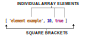
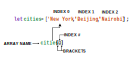

Arrays are basically lists. They can store any data type and like lists they are ***ordered***, meaning each item has a numbered position.

```JS
let newYearsResolutions = ['Keep a journal', 'Take a falconry class', 'Learn to juggle'];
```
<br>

# Creating an Array

One way we can create an array is to use an **array literal**. An array literal creates an array by wrapping items in square brackets [].



### Let’s take a closer look at this array example:

* The array is represented by the square brackets [] and the content inside.
* Each content item inside an array is called an **element**.
* Each element is separated by a comma.
* There are three different elements inside the array.
* Each element inside the array is a different data type.

We can also save an array to a variable like in the first code example above.

<br>

# Accessing Elements

The position of each element in an array is called an **index**. The starting position is always 0.



<br>

### In the code snippet above:

* cities is an array that has three elements: 'New York', 'Beijing', and 'Nairobi'.
* We’re using bracket notation, [], with the index after the name of the array to access the element.
* cities[0] will access the element at index 0 in the array cities. We can think of cities[0] as accessing the space in memory that holds the string 'New York'.

We can also access individual characters in a string using bracket notation and the index. 
For example: 

```JS
const hello = 'Hello World';
console.log(hello[6]);
// Output: W
```

Individual elements from an array can also be stored in variables.

For example if we want to pull New York from the array above and store it in a variable we can do:

```JS
usCity = cities[0];
```

If we try to access and index that does not contain an element we get 'undefined' as output.

<br>

# Update Elements

We can also update the values of elements. For example:

```JS
let seasons = ['Winter', 'Spring', 'Summer', 'Fall'];

seasons[3] = 'Autumn';
console.log(seasons); 
//Output: ['Winter', 'Spring', 'Summer', 'Autumn']
```

<br>

# Arrays with let and const

Elements in an array declared with const remain **mutable** meaning we can change the elements inside the array but can't reassign a new array or value. For example if we declare the array with const array1 we can't change array1 to array2 but we can change the elements inside array1

# The .length property

