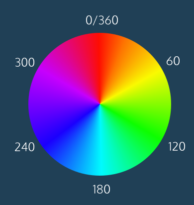

Colors in CSS can be described in three different ways:

Named colors — English words that describe colors, also called keyword colors
RGB — numeric values that describe a mix of red, green, and blue
HSL — numeric values that describe a mix of hue, saturation, and lightness

# Foreground vs Background

In CSS, these two design aspects can be styled with the following two properties:

* color
 - this property styles an element’s foreground color.
* background-color
 - this property styles an element’s background color.

# Hexadecimal

Colors specified using this system are called hex colors. A hex color begins with a # which is followed by three or six characters. The characters represent values for red, blue and green.

Example:

darkseagreen: #8FBC8F
sienna:       #A0522D
saddlebrown:  #8B4513
brown:        #A52A2A
black:        #000000 or #000
white:        #FFFFFF or #FFF
aqua:         #00FFFF or #0FF

```HTML
<a href="https://developer.mozilla.org/en-US/docs/Web/CSS/color_value"> MDN Colors Docs </a>
```

# RGB Colors

“RGB” uses decimal numbers rather than hexadecimal numbers, and it looks like this:
```CSS
h1 {
  color: rgb(74, 189, 235);
}
```
Values represent Red, Green, Blue and Opacity.

# Hue, Saturation & Lightness (HSL)

The syntax for HSL is similar to the decimal form of RGB, though it differs in important ways. The first number represents the degree of the hue, and can be between 0 and 360. The second and third numbers are percentages representing saturation and lightness respectively. 
Example: color: hsl(120, 60%, 70%);

## Hue
refers to an angle on a color wheel. Red is 0 degrees, Green is 120 degrees, Blue is 240 degrees, and then back to Red at 360. You can see an example of a color wheel below.

```HTML

```
## Saturation 
refers to the intensity or purity of the color. The saturation increases towards 100% as the color becomes richer. The saturation decreases towards 0% as the color becomes grayer.

## Lightness 
refers to how light or dark the color is. Halfway, or 50%, is normal lightness. Imagine a sliding dimmer on a light switch that starts halfway. Sliding the dimmer up towards 100% makes the color lighter, closer to white. Sliding the dimmer down towards 0% makes the color darker, closer to black.

# Opacity & Alpha

To use opacity with either RGB or HSL we add "a" at the end which stands for Alpha(channel) aka transparency.

Using the previous RGB example with specified Opacity it would look like this:
rgba(74, 189, 235, 0.89);

The same goes for HSL:
hsla(120, 60%, 70%, 0.89);

Alpha is a decimal number from zero to one. If alpha is zero, the color will be completely transparent. If alpha is one, the color will be opaque. The value for half-transparent would be 0.5

It is unconventional but Hex colors can also use opacity. For them we add a two-digit hexadecimal value at the end which ranges from 00 to FF.
Example: #4266ca88
If we're using a three-digit representation we add one at the end.
Example: #F003

While Alpha can only be used with RGB, Hex or HSL values there is a named word for *zero* opacity- transparent.
Example: color: transparent;

Whatever you assign this to will become invisible. 

